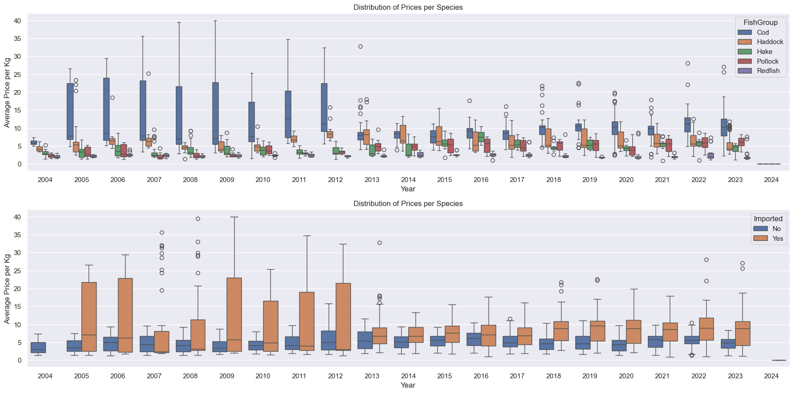
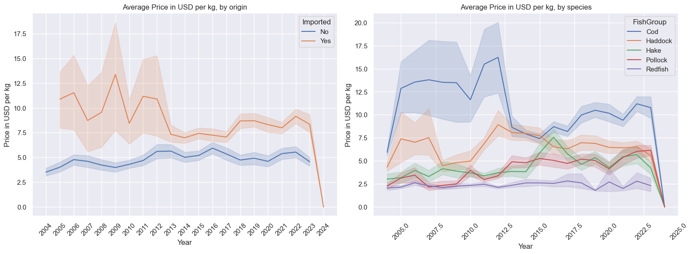
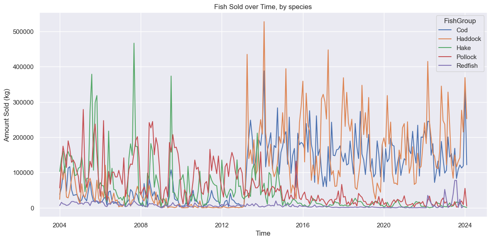

# EDA
Date: 3/11/2024  

**Project:** GMRI  
**Team:** 
* Ned Hallahan (NedHallahan)
* Josh Nougaret (jnougaret)
* Michael Massone (mmkke) - Team Lead


# Data Retrieval:

Data for the following was retrieved from two sources and merged into a single dataframe. Additionally, data was retrieved from BLS CPI data to adjust for inflation.

### Imported

Records of imported fish were obtained from the NOAA FIsheries: Foreign Trade Data. 

Database information: https://www.fisheries.noaa.gov/national/sustainable-fisheries/foreign-fishery-trade-data

Database GUI: https://www.fisheries.noaa.gov/foss/f?p=215:2:5473541341067

Record were obtained directly from NOAA via their API. 

Records included all imports from countries within the conitnet of Europe to Portland, ME of 'Groundfish' species from 2004 onward. 

API query:

```python
query = '''{
    "year":{"$gt": 2004},
    "name":{"$like":"%GROUNDFISH%"}, 
    "custom_district_name":{"$like":"%PORTLAND%"}, 
    "continent":{"$like":"%EU%"}
    }'''
```
Returned 5761 records.  

Attributes:
* year - Year imported.
* month - Month imported.
* hts_number - Harmonized Tariff Schedule number: https://hts.usitc.gov/reststop/file?release=currentRelease&filename=Chapter%203
* name - Species name.
* fus_group_code1 - Fisheries of the United State Group Code 1.
* fus_group_code2 - Fisheries of the United State Group Code 2.
* fus_group1 - Fisheries of the United State Group 1.
* fus_group2 - Fisheries of the United State Group 2.
* cntry_code - Country code.
* cntry_name - Country name.
* continent - Continent of origin. 
* fao - Food and Agriculture Orgnization
* custom_district_code - US Customs District Code. 
* custom_district_name - US Customs District Name. 
* edible_code - Edible/inedible coe.
* kilos - Weight in kilograms.
* val - The price actually paid or payable for merchandise when sold for export to the United States, excluding U.S. import duties, freight, insurance, and other charges incurred in bringing the merchandise to the United States. 
* source - Imported/Domestic
* association - Regional Fishery Managment Associations
* rfmo - Regional Fishery Management Association
* nmfs_region_code = National Marine Fisheries Service Regions code.
* links - API link
* date - YYYY-MM-DD


### Domestic

Records of locally caught fish were obtained throught the Portland Fish Exchange's Price and Landing Tool.

https://www.pfex.org/price-landing-tool/

Report URL
```
https://reports.pfex.org/customreport_csv.asp?submitted=true&startdate=1%2F1%2F2004&enddate=1%2F1%2F2024
```


All fish species from 01/2004 - 01/2024 

Returned 8051 records.

Attributes:
* FishCode (str) - Four letter fish identifying code.
* FishDesc (str) - Description of fish product.
* Consigned (str) - NaN
* Sold (str) - Amount sold in lbs. 
* LowPrice (str) - Min price per pound.
* AvgPrice (str) - Mean price per pound.
* HighPrice (str) - Max price per pound.
* MonthNum (str) - Month Sold
* YearNum (str) - Year Sold


### Inflation Data
Consumer Price Index for All Urban Consumers (CPI-U) was accessed using the BLS API.


https://data.bls.gov/timeseries/CUUR0000SA0

API query:
```python
query = '''
headers = {'Content-type': 'application/json'}
data = json.dumps({"seriesid": ['CUUR0000SA0'],"startyear":str(startYear), "endyear":str(EndYear)})
requests.post('https://api.bls.gov/publicAPI/v2/timeseries/data/', data=data, headers=headers)
'''
```

A scale was set based on the lastest available data.
Essentially...
For all rows in the CPI column
    maxVal in CPI col / val in row

The plan is to use this data to be able to compare dollars accurately as the values change across months and years

# Data Processing:

### NOAA Data

Datafrrame filtered to include only the following attributes:

['kilos', 'val', 'year', 'month', 'fus_group1', 'fus_group2', 'cntry_name']  

Price column was created using 'val' and 'kilos'.

```python
    imports_df.loc[:, 'Price'] = imports_df['val'] / imports_df['kilos']
```

Fus_group2 was mapped to new attibute FIshGroup via the following function:

```python
def map_fish_group(value):
    '''Mapping function for aggregating fish species.'''

    value = value.lower()  # Convert the string to lowercase for consistent comparison
    if 'cod' in value:
        return 'Cod'
    elif 'haddock' in value:
        return 'Haddock'
    elif 'pollock' in value:
        return 'Pollock'
    elif 'hake' in value or 'whiting' in value:  # 'whiting' maps to 'hake'
        return 'Hake'
    elif 'perch' in value:  # 'perch' maps to 'redfish'
        return 'Redfish'
    else:
        return 'Other'  # Assign 'Other' if none of the conditions above are met  
```

Records where FishGroup = Other where dropped from dataframe. 

Lastly, columns where renamed in preparation for merge with PFEX Data:

```python
    imports_df.rename(columns={
                                'kilos': 'AmountSold_by_Kilo',
                                'Price': 'AvgPrice_per_Kilo',
                                'year': 'YearNum',
                                'month': 'MonthNum',
                                'cntry_name': 'Country'
                            }, inplace=True)
```

### PFEX Data

First step was two identity, filter, and aggregate the fish specie sincluded in the data. The raw data contained 140 unqiue FIshCodes and 214 unique FishDesc.

The data was filtered by FishDesc using the following keywards:

['cod', 'haddock', 'pollock', 'flounder', 'hake', 'redfish', 'halibut', 'yellowtail']

This reduced the data down to 4046 records. The records were then aggregated using the FishCodes to map a new variable, FishGroup. 

```python
fish_group_mapping = {
    'C': 'Cod',
    'FA': 'Halibut',
    'FY': 'Yellowtail',
    'HD': 'Haddock',
    'HW': 'Hake',
    'PA': 'Pollock',
    'PO': 'Redfish',
    'Y': 'Yellowtail'
}
```
This aggregated and filtered data was then exported to a new csv: data/pfex_2004-2024_processed.csv


Lastly, the column 'Sold' was converted to Kilos and the name was changed to AmntSold_by_Kilo. Then the AvgPrice (per pound) was converted ot AvgPrice_per_Kilo.

```python
    # Convert 'Sold' from pounds to kilos
    local_df['AmountSold_by_Kilo'] = local_df['Sold'] / 2.20462

    # Convert AvgPrice from $/lb to $/kilo
    local_df['AvgPrice_per_Kilo'] = local_df['AvgPrice'] * 2.20462
```

### Merged Data

Both NOAA and PFEX data were filterd to include only the following columns:

* AmountSold_by_Kilo - Amount sold per record in kilograms.
* AvgPrice_per_Kilo - Price in USD per kilogram.
* YearNum - Year landed/imported.
* MonthNum - Month landed/imported.
* FishGroup - Fish species (Cod, Haddock, Pollock, Hake, Redfish)

The dataframes were merged via pd.concat.

When multiple entries for a single fish species from a single country existed during a single month period, these records where aggregated. AvgPrice_per_Kilo was determined by weighted average and AmountSold_by_Kilo by sum. The column TotalSoldAtPrice was created to aid in  aggregation and was subsequently dropped fromt the dataframe. 

```python
 df_agg = df_dt_idx.groupby(['YYYY/MM', 'FishGroup', 'Country']).agg(
        AmountSold_by_Kilo=('AmountSold_by_Kilo', 'sum'),
        TotalSoldAtPrice=('TotalSoldAtPrice', 'sum')
    ).reset_index()
```

New attributes added after merge:

* YYYY/MM - A datatime period object. 
* Imported - Import status. 

Outlier Filtering:

```python
df_agg = df_agg[df_agg['AvgPrice_per_Kilo'] <= 40]
```
This removed the following records:

| YYYY/MM   | FishGroup   | Country   |   AmountSold_by_Kilo |   AvgPrice_per_Kilo | Imported   |
|:----------|:------------|:----------|----------------------:|--------------------:|:-----------|
| 2022-03   | Cod         | FAROE IS. |                    64 |                  75 | Yes        |


# EDA:

### Amount Sold by Species


A much larger amount of imported fish has been sold in Portland, with the exception of Pollock. 

As seen throughout the data, there is a major increase in cod and haddock imports starting in 2013. More invetigation is needed to determine if this is a real trend or some artifact of the data collection or processing.

### Price


The mean price is generally higher for imported fish. Will price per kg generally ranges between 1 and 10 USD. Imported cod is more likely to command the highest prices. 

Price distribution by year:



Mean price over time:


Mean price over time be species, imported vs domestic:


Price vs amount landed/imported:


When plotting the price vs amount sold for all species there is potentially some clustering by origin and by species. 

In general, 2013 seems ot be a major year in terms of where fish are being sourced from and the prices for fish, both domestic and imported. Overall there is much more variation in the prices of imported fish. Reasons for this variation and impact on domestic fish prices are one potential avenue for investigation. 


### Amount Sold over Time:





As noted above, there is a very large increase in imported Cod and Hake around 2013. Is this an error in data retrieval/processing, or does it represent a real trend? Can we confirm with outside sources. Discussion with the stakeholder may be needed to understand this aspect of the data.

Looking at the NOAA report for 2013, we can see that the tonnage of of imported Cod increased from 37,036 metric tons the previosu year to 45321 metric tons. However, this data is for all Cod, imported in all customs districts from any country. 

https://www.st.nmfs.noaa.gov/Assets/commercial/trade/Trade2013.pdf

Additionally, the NOAA FIsheries GUI: confirms this increase suggesting it's not an error in data retrieval. 

https://www.fisheries.noaa.gov/foss/f?p=215:2:16678495974590:::::

https://www.fisheries.noaa.gov/foss/f?p=215:200:5322272781522:::::


# MAKE COMMANDS
### make create_environment
Command to create/activate the conda env

### make setup_dir
Command to create \figs, \srs, and \data directories

### make get_data 
Command to get retrieve data and run preprocessing for eda
* Note that running get_data repeatedly over a short window of time may cause API's to refuse requests.

### make run_eda
Command to run eda and create and populate figures for for EDA.md
* Note Arial Font may not be available on some systems and could throw warning

### make clean
Command to clean Data and Figs folder


# Questions/Next Steps:

The date range for our data can be adjusted depending on the needs of the stakeholder. What range should we be investigating?  

Should we adjust our aggregation for a more granular investigation species/product type?

Would we benefit from sourcing all data through NOAA to expand the range of our data beyond fish landed and brought for sale to Portland (pfex data) specically, to include all of Maine?

What accounts for the increase in imported Cod and Hake around 2013. Is this an error in data retrieval/processing, or does it represent a real trend? Can we confirm with outside sources. 

# Acknowlefgements

*  NOAA Fisheries Office of Science and Technology, Commercial Landings Query, Available at: www.fisheries.noaa.gov/foss, Accessed 03/10/2024
* https://www.bls.gov/developers/api_python.htm, Accessed 3/7/2024
