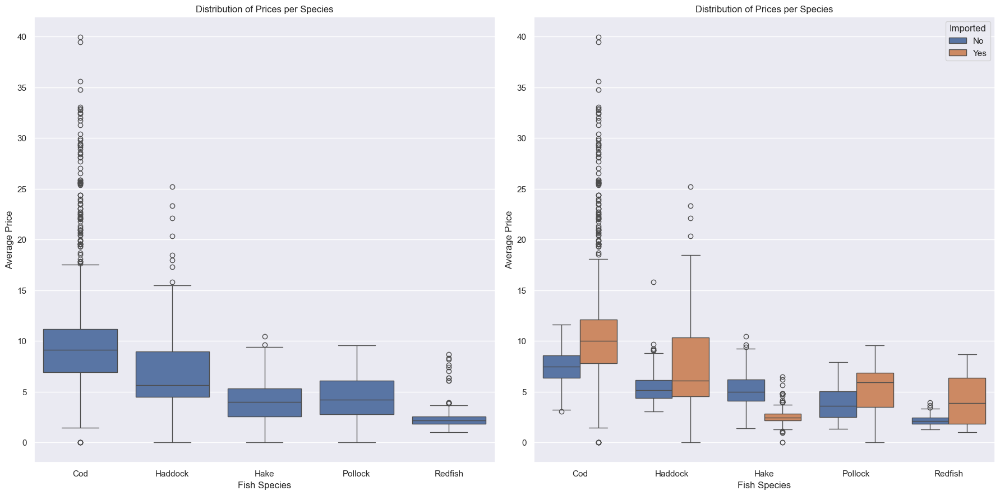
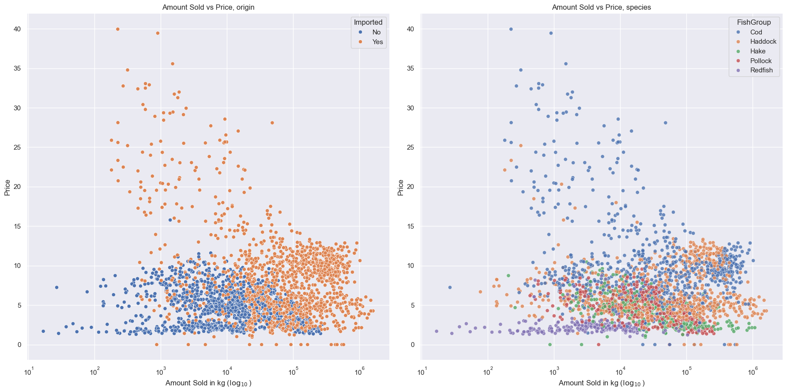
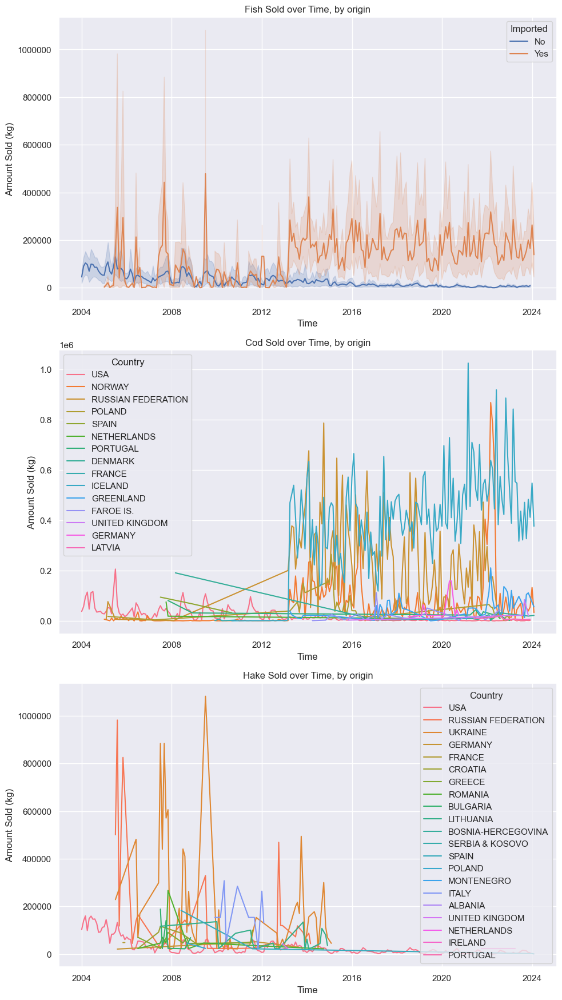

# EDA
Date: 3/11/2024  

**Project:** GMRI  
**Team:** 
* Ned Hallahan (NedHallahan)
* Josh Nougaret (jnougaret)
* Michael Massone (mmkke) - Team Lead


# Data Retrieval:

Data for the following was retrieved from two sources and merged into a single dataframe.  

### Imported

Records of imported fish were obtained from the NOAA FIsheries: Foreign Trade Data. 

Database information: https://www.fisheries.noaa.gov/national/sustainable-fisheries/foreign-fishery-trade-data

Database GUI: https://www.fisheries.noaa.gov/foss/f?p=215:2:5473541341067

Record were obtained directly from NOAA via their API. 

Records included all imports from countries within the conitnet of Europe to Portland, ME of 'Groundfish' species from 2004 onward. 

API query:

```python
query = '''{
    "year":{"$gt": 2004},
    "name":{"$like":"%GROUNDFISH%"}, 
    "custom_district_name":{"$like":"%PORTLAND%"}, 
    "continent":{"$like":"%EU%"}
    }'''
```
Returned 5761 records.  

Attributes:
* year - Year imported.
* month - Month imported.
* hts_number - 
* name - Species name.
* fus_group_code1 - Fisheries of the United State Group Code 1.
* fus_group_code2 - Fisheries of the United State Group Code 2.
* fus_group1 - Fisheries of the United State Group 1.
* fus_group2 - Fisheries of the United State Group 2.
* cntry_code - Country code.
* cntry_name - COuntry name.
* continent - COnitnent of origin. 
* fao - Food and Agriculture Orgnization
* custom_district_code - US Customs District Code. 
* custom_district_name - US Customs District Name. 
* edible_code - Edible/inedible coe.
* kilos - Weight in kilograms.
* val - The price actually paid or payable for merchandise when sold for export to the United States, excluding U.S. import duties, freight, insurance, and other charges incurred in bringing the merchandise to the United States. 
* source - Imported/Domestic
* association - Regional Fishery Managment Associations
* rfmo - Regional Fishery Management Association
* nmfs_region_code = National Marine Fisheries Service Regions code.
* links - API link
* date - YYYY-MM-DD


### Domestic

Records of locally caught fish were obtained throught the Portland Fish Exchange's Price and Landing Tool.

https://www.pfex.org/price-landing-tool/


# Data Processing:

### NOAA Data

Datafrrame filtered to include only the following attributes:

['kilos', 'val', 'year', 'month', 'fus_group1', 'fus_group2', 'cntry_name']  

Price column was created using 'val' and 'kilos'.

```python
    imports_df.loc[:, 'Price'] = imports_df['val'] / imports_df['kilos']
```

Fus_group2 was mapped to new attibute FIshGroup via the following function:

```python
def map_fish_group(value):
    '''Mapping function for aggregating fish species.'''

    value = value.lower()  # Convert the string to lowercase for consistent comparison
    if 'cod' in value:
        return 'Cod'
    elif 'haddock' in value:
        return 'Haddock'
    elif 'pollock' in value:
        return 'Pollock'
    elif 'hake' in value or 'whiting' in value:  # 'whiting' maps to 'hake'
        return 'Hake'
    elif 'perch' in value:  # 'perch' maps to 'redfish'
        return 'Redfish'
    else:
        return 'Other'  # Assign 'Other' if none of the conditions above are met  
```

Records where FishGroup = Other where dropped from dataframe. 

Lastly, columns where renamed in preparation for merge with PFEX Data:

```python
    imports_df.rename(columns={
                                'kilos': 'AmountSold_by_Kilo',
                                'Price': 'AvgPrice_per_Kilo',
                                'year': 'YearNum',
                                'month': 'MonthNum',
                                'cntry_name': 'Country'
                            }, inplace=True)
```

### PFEX Data


### Merged Data

Both NOAA and PFEX data were filterd to include only the following columns:

* AmountSold_by_Kilo - Amount sold per record in kilograms.
* AvgPrice_per_Kilo - Price in USD per kilogram.
* YearNum - Year landed/imported.
* MonthNum - Month landed/imported.
* FishGroup - Fish species (Cod, Haddock, Pollock, Hake, Redfish)

The dataframes were merged via pd.concat.

When multiple entries for a single fish species from a single country existed during a single month period, these records where aggregated. AvgPrice_per_Kilo was determined by weighted average and AmountSold_by_Kilo by sum. The column TotalSoldAtPrice was created to aid in  aggregation and was subsequently dropped fromt the dataframe. 

```python
 df_agg = df_dt_idx.groupby(['YYYY/MM', 'FishGroup', 'Country']).agg(
        AmountSold_by_Kilo=('AmountSold_by_Kilo', 'sum'),
        TotalSoldAtPrice=('TotalSoldAtPrice', 'sum')
    ).reset_index()
```

New attributes added after merge:

* YYYY/MM - A datatime period object. 
* Imported - Import status. 

Outlier Filtering:

```python
df_agg = df_agg[df_agg['AvgPrice_per_Kilo'] <= 40]
```
This removed the following records:

| YYYY/MM   | FishGroup   | Country   |   AmountSold_by_Kilo |   AvgPrice_per_Kilo | Imported   |
|:----------|:------------|:----------|----------------------:|--------------------:|:-----------|
| 2022-03   | Cod         | FAROE IS. |                    64 |                  75 | Yes        |


# EDA:

### Amount Sold by SPecies


### Price






### Amount Sold over Time:





# Questions/Next Steps:

The date range for our data can be adjusted depending on the needs of the stakeholder. What range should we be investigating?  

Should we adjust our aggregation for a more granular investigation species/product type?

What accounts for the increase in imported Cod and Hake around 2013. Is this an error in data retrieval/processing, or does it represent a real trend? Can we confirm with outside sources. 

# Acknowlefgements

*  NOAA Fisheries Office of Science and Technology, Commercial Landings Query, Available at: www.fisheries.noaa.gov/foss, Accessed 03/10/2024
