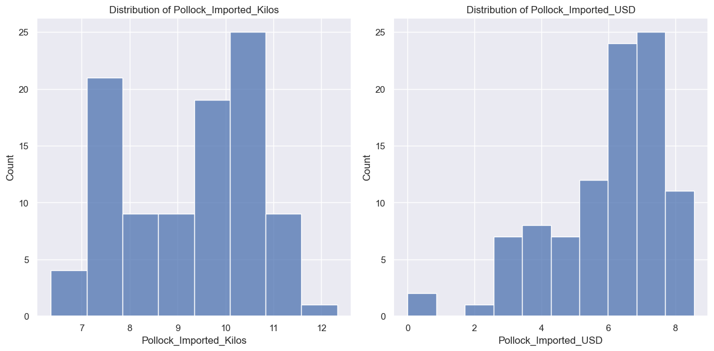
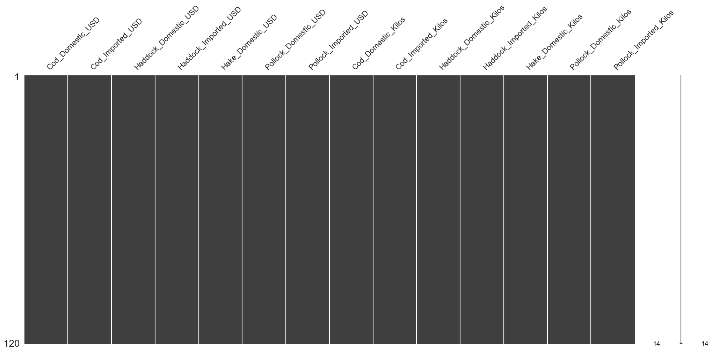
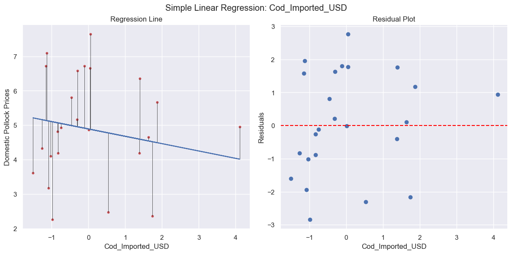
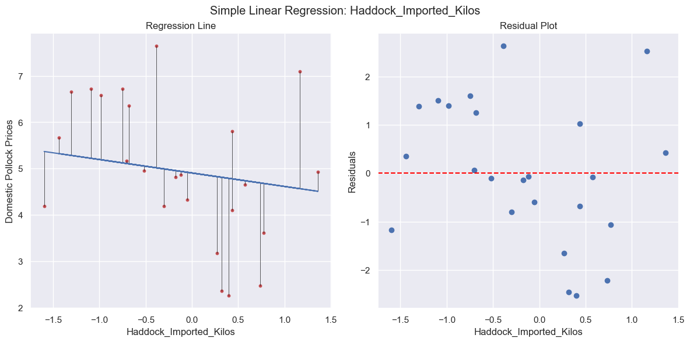
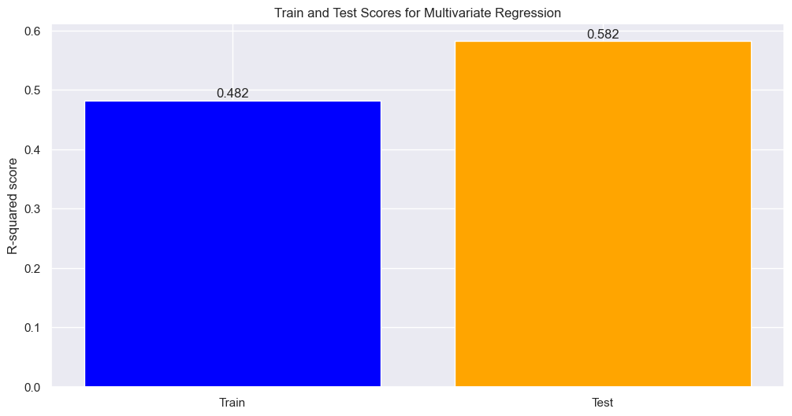
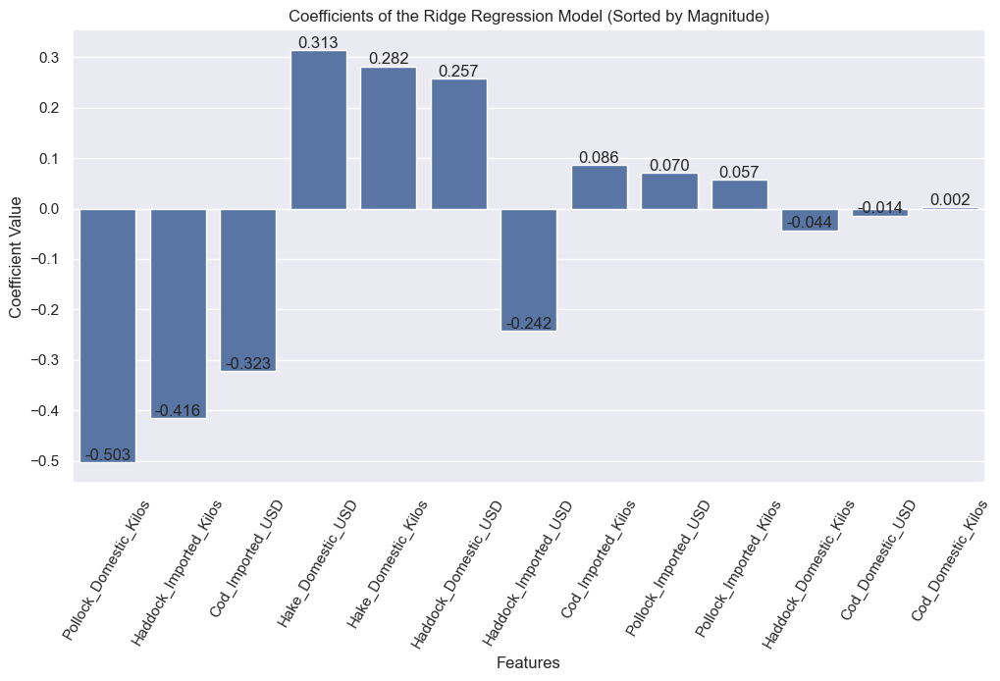

___
## Goal

To determine if imports in groundfish from countries with fisheries in the Barent's Sea impact the the price of Dometically landed Pollock in Maine. This inquiry is guided by the premise that increasing limits on the Cod and Hadddock catches in the Barents Sea over the past 4 years had has a postiive impact on the market price of previously less desirable species like Pollock for Maine fisherman. Within the context of a complex global market, with impacts numerous trade and energy related variables at play, we would like to determine what, if any, role the Barent's Sea fishery plays in influencing market price for domestic pollock in Maine. 

___
## Approach

Our approach is to perfrom a regression analysis of the various groundfish imported and domestic catches, both quantity and price, on Domestic Pollock prices at the Portland Fish Exchange. Using Data from the Portland Fish Exchange and the NOAA's Fishery Database from 2014 till the present. 

___
## Prep Data

Run the following make command to run the src/modeling_prep.py file. This file will access the data and perform additional EDA and preprocessing regression analysis. Feature Matrix and Target Vector with be saved as CSVs. 

```Make
make model_prep
```


### Format Data for Modeling

Data was imported from the NOAA FIsheries Database and the Portland FIsh Exchangen (PFE) and combined into a single csv. ALthought he NOAA data was reported daily, the PFE is reported monthly, so NOAA data was summariezed as montlhy reports. After importing an basic preprocessing as seen in EDA, the price information was adjusted for inflation during EDA.

Data is accessed using the get_data() and preprocess_data() functions for eda_util.py. Documentaion for these function is included in EDA.md.

```python
    # get data
    data = get_data()

    # preprocess data
    data = preprocess_data(data)
```

### Select Countries of Interest

THe import information obtained from NOAA covered all imports from Europe. The countries of interest, those that have Barent's Sea Fisheries, Iceland, Norway, and Russia where selected combined dataset. from the data along with USA data from the PFE.


```python
 data_filtered = data[data['Country'].isin(['USA', 'ICELAND', 'NORWAY', 'RUSSIAN FEDERATION'])]
 ```

### Create Pivot Tables

The selected data was then formated for regression analysis. Two pivot tables where created, one for quantity and the other for value. Table rows are period indexes with the format MM/YYYY. The columns are the the fish species and origin. These two tables where then joined into a single dataframe. 

```python
    ### Create Pivot Tables
    # drop the 'Country' column
    data_without_country = data_filtered.drop('Country', axis=1)

    # create a unique identifier for each fish group by its import status
    data_without_country['FishGroup_ImportStatusValue'] = np.where(data_without_country['Imported'] == 'Yes',
                                                            data_without_country['FishGroup'] + "_Imported_USD",
                                                            data_without_country['FishGroup'] + "_Domestic_USD")

    # create a unique identifier for each fish group by its import status
    data_without_country['FishGroup_ImportStatusAmount'] = np.where(data_without_country['Imported'] == 'Yes',
                                                            data_without_country['FishGroup'] + "_Imported_Kilos",
                                                            data_without_country['FishGroup'] + "_Domestic_Kilos")

    # pivot the table to have dates as rows and the unique fish group import statuses as columns, with average prices as values
    df_value = data_without_country.pivot_table(index='YYYY/MM', 
                                                columns='FishGroup_ImportStatusValue', 
                                                values='AvgPrice_per_Kilo',
                                                aggfunc='mean')
    # pivot the table to have dates as rows and the unique fish group import statuses as columns, with average prices as values
    df_amount = data_without_country.pivot_table(index='YYYY/MM', 
                                                columns='FishGroup_ImportStatusAmount', 
                                                values='AmountSold_by_Kilo',
                                                aggfunc='sum')
```


### Check Distribution of Features

The feature columns where plotted as histograms to visually assess the distributions. 


### Transform Value Features

Because the quantity data was skewed, we implemented a log transformation to try to produce more normally distributed data. The results of that transformation can be seen below. 


### Set Time Frame

We selected a timeframe of 10 year period from 01/2014 to 01/2024. 

```python
    ### Set Time Frame
    start_period = pd.Period('2014-01', freq='M')
    end_period = pd.Period('2024-04', freq='M')
    filtered_df_range = df_combined[(df_combined.index >= start_period) & (df_combined.index <= end_period)].copy()
```

### Drop NaN Values and Impute

At this point the data included many NaN values that needed to be resolved before regression could be done. 


Some of the less relevant columns with a high number of NaN values where dropped completely. These included:

['Hake_Imported_USD', 'Hake_Imported_Kilos', 'Redfish_Imported_USD', 'Redfish_Domestic_USD', 'Redfish_Domestic_Kilos', 'Redfish_Imported_Kilos']

Since out main focus of the inquiry was Haddock, Cod and Pollock it did not seem necessary to keep these in the analysis with such a large percentage of NaN values.


The Imported Pollock data also included some NaN values, but these seemed more likely to have a strong bearing on our analysis. We visualized the distributions to insure a normal-like distrabution, then imputed the values using mean. 



Lastly we eliminated any remaining rows with NaN values. 



The final results was a Feature Matrix with 120 rows and 13 features. 

### Visualize Data

A quick visualization of the value and amount over time. 


Check for effects of seaonality with boxplots.


### Correlations and Pairplots

Checking for correlation amoung the features. 


There do appear to be some minor correlations between some of the features. At this point we will not drop any features from the analysis, but we will need to look into ways of account for covariance in the regression analysis. 


### Scaling

We utlilized scikit-learns Standard Scaler to normalize and mean center features prior to analysis. 


### Export Feature Matrix and Target Vector		

The feature matrix and target vector were saved as CSVs. 


___
## Modeling

Run the following make command to run the src/modeling.py file. This file will run several regression analysis and return the results and plots. 

```Make
make modeling
```

### Statsmodel Summary

Our first step was to generate a Statmodel Summary report for the Ordinary Least Square Regression of our Features Matrix (X) on the Target Vector (y). 

  

\
Explained Variance Ratio (R^2):


$R^2 = 1 - \frac{{\sum_{i=1}^n (y_i - \hat{y}_i)^2}}{{\sum_{i=1}^n (y_i - \bar{y})^2}} = \frac{\text{Explained Sum of Squares}}{\text{Total Sum of Squares}} = 0.518$  

This summary demonstates that the Oridnary Least Square regression model explains about 52% of the total variance in the domestic Pollock value. The Adjustred R-squared value indicates that some of our variables are not contributing to the overall score, since R-squared tends to increase with more features. 

F-statistic and Prob (F-statistic):

THe F-statistic compares the regression model obtained to the null hypothesis (that domestic pollock prices are independent of the features) where the coeffecients of all variables are zero. The probability of the F-statistic gives the probability that the null hypothesis is true, given the the F-statistic. In this case, it is quite low indicating that the regression model is likely producing a signifigant result and will be a useful approach to pursue. 

Coefficients:

With p-value < 0.01:
```Markdown
==========================================================================================
                             coef    std err          t      P>|t|      [0.025      0.975]
------------------------------------------------------------------------------------------
Cod_Imported_USD          -0.3615      0.127     -2.855      0.005      -0.612      -0.110
Hake_Domestic_USD          0.4876      0.121      4.030      0.000       0.248       0.728
Haddock_Imported_Kilos    -0.5231      0.128     -4.099      0.000      -0.776      -0.270
Hake_Domestic_Kilos        0.4379      0.142      3.091      0.003       0.157       0.719
Pollock_Domestic_Kilos    -0.8893      0.178     -5.002      0.000      -1.242      -0.537
```
Imported Cod and Haddock do seem to have a signifigant effect, as expected, on Pollock prices. There are also several domestic factors that seem to be influencing pollock price. Not suprisingly, the amount of domestic Pollock caught has a negative impact on price. Based on this analysis it seems that Pollock_Domestic_Kilos has the strongest effect, however we can use other regression methods to remove covariance and see if this is still true. 


The plot of the residuals below shows a distribution of residuals that appears random. Again this is a good indicator that a linear model is good fit for this dataset. 


### Univariate Regression

Next step is to compute the univariate regression for all features in our dataset. 


We can select and look at the regression line and residual plot for all features that had a signifigant p-value:


 


Visually there apear to be a high degree of dias in some cases. For example, the regression for HAddock_Imported_Kilos might be better represented with a polynmial regression. Since we are less concerned with individual relationships we will move on to try to improve the multivariate regression.   


### Multivariate Regression

Mutivariate Regression using scikit-learn with train test split. 

Results:

```Markdown
MULTIVARIATE REGRESSIONS
R-squared: 0.5823919767940072
Mean Squared Error: 0.9472081346425588
Intercept: [4.92655315]
```





### PCR

Since we have 13 features attempting some dimensionality reduction is another possible avenue for improving our regression analysis. In this analysis we perfmored a Principle Component Regression, using a gridsearch with cross-validation over the number of components.

**Results:**
```Markdown
PRINCIPAL COMPONENT REGRESSION
R-squared: 0.5221034655154911
Mean Squared Error: 1.0839530368838926
Intercept: [4.89311077]
Best Parameters: {'pca__n_components': 11}
```


Performing a gridsearch over the value of n_components failed to produce a low dimensional embedding of the data that retains most of the variance. Based on this model, the variance if distributed across the feature space. 

**Grid Search over n_components with 5 Fold Cross Validation**  


The gridsearch found the max mean cross validation score with 11 components. 


### Ridge


**Results:**
```Markdown
RIDGE REGRESSION
Best alpha: 16.357378899298137
Mean Squared Error with best alpha: 1.026846438709015
R-squared: 0.5472807974065743
```



**Grid Search over Alpha with 5 Fold Cross Validation**  


The gridsearch found the max mean cross validation score with with a regularization parameter (alpha) of ~16.357. 


### Lasso

Since we have some features that are likely not contributing to the explained varaince, A LASSO regression might provide a better result as its regularization parameter can reduce these coefficients to zero. This should reduce the impact of covariance on the model. 

**Results:**
```Markdown
LASSO REGRESSION
Best alpha: 0.05898896425508499
Mean Squared Error with best alpha: 0.9471284759470703
R-squared: 0.5824270969636274
```

These reults are the same as the mutlivariate regression, suggesting that that is not a high enough degree of colineairty for LASSO to penalize any feature enough to reduce the coeficient to zero. 


**Grid Search over Alpha with 5 Fold Cross Validation**  


The gridsearch found the max mean cross validation score with with a regularization parameter (alpha) of ~0.0590. 


___
## Signifigance Testing


Significance Testing was done using p_values of F-Tests of the models against each other and a 'random' model we made based on normal distribution of data. Results we failed to reject there was a significant difference between any model we constructed but they were all significantly better then
an informed random guess.

Would love some commentary on here on if and how we can improve? Finding a null hypothesis for predictions seems difficult?


___
## Conclusion

TBD
___ 
## Acknowledgements


