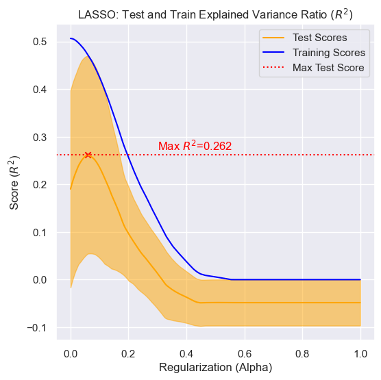

___
## Goal

To determine if imports of groundfish from countries with fisheries in the Barents Sea impact the price of domestically landed Pollock in Maine. This inquiry is guided by the premise that recent restrictions, which decreased the catch limits for Cod and Haddock in the Barents Sea over the past four years, have had a positive impact on the market price of previously less desirable species like Pollock for Maine fishermen. The goal of our project is to determine what role, if any, the Barents Sea fishery plays in influencing market price for 
Domestic Pollock in Maine. We set out to accomplish this task with the understanding that numerous trade and energy related variables are at play within the context of a complex global market.

___
## Approach

Our approach is to perform a regression analysis on Domestic Pollock prices at the Portland Fish Exchange, incorporating the prices and quantities of various imported and domestic groundfish catches as inputs to the model. We use data provided by the Portland Fish Exchange and the NOAA Fisheries Database from 2014 to 2024. 

___
## Prep Data and Environment

Run the following make commands to setup the environment and run the src/modeling_prep.py file. This file will access the data and perform additional EDA and preprocessing regression analysis. The Feature Matrix and Target Vector will be saved as CSV files. 

```Make
make                # environment
make model_prep     # setup, fetch data, modeling prep
```


### Format Data for Modeling

Data was imported from the NOAA Fisheries Database and the Portland Fish Exchange (PFE) and combined into a single  CSV file. Althought the NOAA data was reported daily, PFE data is reported monthly. For this reason, NOAA data was summarized as monthly reports. After importing basic preprocessing steps as seen in the EDA, the price information was adjusted for inflation.

Data is accessed using the get_data() and preprocess_data() functions for eda_util.py. Documentation for these functions is included in EDA.md.

```python
    # get data
    data = get_data()

    # preprocess data
    data = preprocess_data(data)
```

### Select Countries of Interest

The data obtained from NOAA encompassed all imports from Europe. From this dataset, we selected countries with Barents Sea fisheries—namely Iceland, Norway, and Russia—along with Domestic landings in Portland, Maine from the Portland Fish Exchange.


```python
 data_filtered = data[data['Country'].isin(['USA', 'ICELAND', 'NORWAY', 'RUSSIAN FEDERATION'])]
 ```

### Create Pivot Tables

The selected data was then formatted for regression analysis. Two pivot tables were created: one for quantity and the other for value, with table rows formatted as period indexes in the MM/YYYY format. The Portland Fish Exchange data, which reported monthly totals, served as the limiting factor in terms of the time scale. The columns in these tables represent the fish species and their origin (domestic versus imported). These two tables were subsequently merged into a single dataframe for further preprocessing.

```python
    ### Create Pivot Tables
    # drop the 'Country' column
    data_without_country = data_filtered.drop('Country', axis=1)

    # create a unique identifier for each fish group by its import status
    data_without_country['FishGroup_ImportStatusValue'] = np.where(data_without_country['Imported'] == 'Yes',
                                                            data_without_country['FishGroup'] + "_Imported_USD",
                                                            data_without_country['FishGroup'] + "_Domestic_USD")

    # create a unique identifier for each fish group by its import status
    data_without_country['FishGroup_ImportStatusAmount'] = np.where(data_without_country['Imported'] == 'Yes',
                                                            data_without_country['FishGroup'] + "_Imported_Kilos",
                                                            data_without_country['FishGroup'] + "_Domestic_Kilos")

    # pivot the table to have dates as rows and the unique fish group import statuses as columns, with average prices as values
    df_value = data_without_country.pivot_table(index='YYYY/MM', 
                                                columns='FishGroup_ImportStatusValue', 
                                                values='AvgPrice_per_Kilo',
                                                aggfunc='mean')
    # pivot the table to have dates as rows and the unique fish group import statuses as columns, with average prices as values
    df_amount = data_without_country.pivot_table(index='YYYY/MM', 
                                                columns='FishGroup_ImportStatusAmount', 
                                                values='AmountSold_by_Kilo',
                                                aggfunc='sum')
```


### Check Distribution of Features

The feature columns were plotted as histograms to visually assess the distributions. 


### Transform Value Features

The value columns appeared close to normally distributed. However, the quantity distributions appeared skewed so we implemented a log transformation to try to produce more normally distributed data. The results of that transformation can be seen below. 


### Set Time Frame

We selected a timeframe of the 10 year period from 01/2014 to 01/2024. This timeframe was chosen to encompass all available data following the 2012 declaration of the Northeast Multispecies Groundfish Fishery as a fishery disaster area, which led to significant changes in Import trends. Our focus was specifically on trade and price dynamics from countries fishing in the Barents Sea within the post-2013 paradigm.

```python
    ### Set Time Frame
    start_period = pd.Period('2014-01', freq='M')
    end_period = pd.Period('2024-04', freq='M')
    filtered_df_range = df_combined[(df_combined.index >= start_period) & (df_combined.index <= end_period)].copy()
```

### Drop NaN Values and Impute

At this point the data included many NaN values that needed to be resolved before regression could be performed. We used the Missingno library to visually assess the ratio and distribution of NaN values within the dataset.  


Some of the less relevant columns with a high number of NaN values where dropped completely. These included:

['Hake_Imported_USD', 'Hake_Imported_Kilos', 'Redfish_Imported_USD', 'Redfish_Domestic_USD', 'Redfish_Domestic_Kilos', 'Redfish_Imported_Kilos']

Since the main focus of our inquiry was on Haddock, Cod and Pollock, it did not seem necessary to keep these in the analysis with such a large percentage of NaN values.


The Imported Pollock data also included NaN values, but these seemed more likely to have a strong bearing on our analysis. We visualized the distributions to insure a normal-like distrabution, then imputed the values using mean. 


Lastly we eliminated any remaining rows with NaN values. 


The final results was a Feature Matrix with 120 rows and 13 features, with each row represents one month over the past 10 years. Price data objects represent the mean price per kg for that month, and quantity data objects are the total of landing of imported fish for that month.

### Visualize Data

A quick visualization of the value and amount over time. 

  


We can see an increase int he price of imported Cod and Haddock over the past two years with what appears to be the start of a downward trend in the volume of same. This could be indicators that our intial assumption that changes in Barents Sea fishing policy is impacting imports to Maine. The relation of these trends to Pollock prices is not clear from this visualization.
 

Check for effects of seaonality with boxplots.


There is not clear impact of seaonality on price based on this plot. There may be some effect on volume, but the realtionship is not clear. 

### Correlations and Pairplots

Checking for correlation amoung the features. 


There do appear to be some minor correlations between some of the features. At this point we will not drop any features from the analysis, but we will need to look into ways of account for potential covariances in the regression analysis. 


### Scaling

We utlilized scikit-learns Standard Scaler to normalize and mean center features prior to analysis. 


### Export Feature Matrix and Target Vector		

The feature matrix and target vector were saved as CSVs. 


___
## Modeling

Run the following make command to run the src/modeling.py file. This file will run several regression analysis and return the results and plots. 

```Make
make modeling
```

### Statsmodel Summary

Our first step was to generate a Statmodel Summary report for the Ordinary Least Square Regression of our Features Matrix (X) on the Target Vector (y). 

  

\
Explained Variance Ratio (R^2):


$R^2 = 1 - \frac{{\sum_{i=1}^n (y_i - \hat{y}_i)^2}}{{\sum_{i=1}^n (y_i - \bar{y})^2}} = \frac{\text{Explained Sum of Squares}}{\text{Total Sum of Squares}} = 0.518$  

This summary demonstates that the Oridnary Least Square regression model explains about 52% of the total variance in the domestic Pollock value. The Adjustred R-squared value indicates that some of our variables are not contributing to the overall score, since R-squared tends to increase with more features. 

F-statistic and Prob (F-statistic):

The F-statistic compares the regression model obtained to the null hypothesis (that domestic pollock prices are independent of the features) where the coeffecients of all variables are zero. The probability of the F-statistic gives the probability that the null hypothesis is true, given the the F-statistic. In this case, it is quite low indicating that the regression model is likely producing a signifigant result and will be a useful approach to pursue. 

Coefficients:

With p-value < 0.01:
```Markdown
==========================================================================================
                             coef    std err          t      P>|t|      [0.025      0.975]
------------------------------------------------------------------------------------------
Cod_Imported_USD          -0.3615      0.127     -2.855      0.005      -0.612      -0.110
Hake_Domestic_USD          0.4876      0.121      4.030      0.000       0.248       0.728
Haddock_Imported_Kilos    -0.5231      0.128     -4.099      0.000      -0.776      -0.270
Hake_Domestic_Kilos        0.4379      0.142      3.091      0.003       0.157       0.719
Pollock_Domestic_Kilos    -0.8893      0.178     -5.002      0.000      -1.242      -0.537
```
Imported Cod and Haddock prices do seem to have a signifigant effect, as predicted, on Pollock prices. There are also several domestic factors that seem to be influencing pollock price. Not suprisingly, the amount of domestic Pollock caught has a signifigant negative impact on price. Based on this analysis it seems that Pollock_Domestic_Kilos has the strongest impact on our dependent variable.


The plot of the residuals below shows a distribution of residuals that appears random. Again this is a good indicator that a linear model is good fit for this dataset. 


Our next steps will be to further investigate the relationship between X and y an dtry to find a regression model with the best possible predictive power as measured by explained varaince. To do so we will look at univariate, multivariate, and PCR regressions. Additonaly, we will try LASSO and Ridge Regresion model to better gernalize the model by regularizing the coeffecients.

### Univariate Regression

Next step is to compute the univariate regression for all features in our dataset. 


We can select and look at the regression line and residual plot for all features that had a signifigant p-value:


 


Visually there apear to be a high degree of bias in some cases. For example, the regression for Haddock_Imported_Kilos might be better represented with a polynmial regression. Since we are less concerned with individual relationships we will move on to try to improve the multivariate regression.   


### Multivariate Regression

Mutivariate Regression using scikit-learn with train test split. 

Results:

```Markdown
MULTIVARIATE REGRESSIONS
R-squared: 0.5823919767940072
Mean Squared Error: 0.9472081346425588
Intercept: [4.92655315]
```

The explained variance ratio is somewhat improved over the intial statmdodel estimate. Interestingly, this model perfomed better on the test data than on the trianing data. 


### PCR

Since we have 13 features attempting some dimensionality reduction is another possible avenue for improving our regression analysis. In this analysis we performed a Principle Component Regression, using a gridsearch with cross-validation over the number of components.

**Results:**
```Markdown
PRINCIPAL COMPONENT REGRESSION
R-squared: 0.5221034655154911
Mean Squared Error: 1.0839530368838926
Intercept: [4.89311077]
Best Parameters: {'pca__n_components': 11}
```


Performing a gridsearch over the value of n_components failed to produce a low dimensional embedding of the data that retains most of the variance. Based on this model, the variance if distributed across the feature space. 

**Grid Search over n_components with 5 Fold Cross Validation**  


The gridsearch found the max mean cross validation score with 11 components. 


### Ridge

THe Ridge regression performs shrinkage by reducing the impact of low performing variables on the result. It does so by applying a penalty term $(\lambda)$. THe value of the penality is determined by the alpha, over which we will perform a gridsearch with cross validation, to find the best performing valu eof alpha. A valu eof 0 indicates no shrinkage of the coefficients. As the alpha increase so doe sthe amount of shrinkage or regularization. 

Object Function for Ridge:

$ \text{minimize} \left( \frac{1}{2n} \sum_{i=1}^{n} (y_i - \beta_0 - \sum_{j=1}^{p} \beta_j x_{ij})^2 + \lambda \sum_{j=1}^{p} \beta_j^2 \right) $

where:

- $(n)$ is the number of samples,
- $(p)$ is the number of features,
- $(y_i)$ is the target value for the $(i)$th sample,
- $(x_{ij})$ is the value of the $(j)$th feature for the $(i)$th sample,
- $(\beta_0, \beta_1, \ldots, \beta_p)$ are the coefficients,
- $(\lambda)$ is the regularization parameter.


**Results:**
```Markdown
RIDGE REGRESSION
Best alpha: 16.357378899298137
Mean Squared Error with best alpha: 1.026846438709015
R-squared: 0.5472807974065743
```


**Grid Search over Alpha with 5 Fold Cross Validation**  


The gridsearch found the max mean cross validation score with with a regularization parameter (alpha) of ~16.357. Based on the non-zero alpha we can see that the regularization technique is having an impact. The explained variance of the model is not improved in terms of it's genralization to test data. 


### Lasso

Since we have some features that are likely not contributing to the explained varaince, A LASSO regression might provide a better result as its regularization parameter can reduce these coefficients to zero. This should reduce the impact of covariance on the model. 

Objective Function fo LASSO:

$ \text{minimize} \left( \frac{1}{2n} \sum_{i=1}^{n} (y_i - \beta_0 - \sum_{j=1}^{p} \beta_j x_{ij})^2 + \lambda \sum_{j=1}^{p} |\beta_j| \right) $

where:

- $(n)$ is the number of samples,
- $(p)$ is the number of features,
- $(y_i)$ is the target value for the $(i)$th sample,
- $(x_{ij})$ is the value of the $(j)$th feature for the $(i)$th sample,
- $(\beta_0, \beta_1, \ldots, \beta_p)$ are the coefficients,
- $(\lambda)$ is the regularization parameter.

**Results:**
```Markdown
LASSO REGRESSION
Best alpha: 0.05898896425508499
Mean Squared Error with best alpha: 0.9471284759470703
R-squared: 0.5824270969636274
```

These reults are the same as the mutlivariate regression, suggesting that that is not a high enough degree of colinearity for LASSO to penalize any feature enough to reduce the coeficient to zero. 


**Grid Search over Alpha with 5 Fold Cross Validation**  



The gridsearch found the max mean cross validation score with with a regularization parameter (alpha) of ~0.0590. 


___
## Signifigance Testing


Significance Testing was done using p_values of F-Tests of the models against each other and a 'random' model we made based on normal distribution of data. Results we failed to reject there was a significant difference between any model we constructed but they were all significantly better then
an informed random guess.

Would love some commentary on here on if and how we can improve? Finding a null hypothesis for predictions seems difficult?


___
## Results

Our best model's returned an explained variance ratio of ~0.58. Due to the complexity of market factors impacting price of Pollock, this seems to be a reasonable result. It is clear that there are many features not included in our data set that are affecting price - as anticipated. However, of the 58% of the varaince that is explained, several features do stand out as having 

___
## Next Steps
___ 
## Acknowledgements

