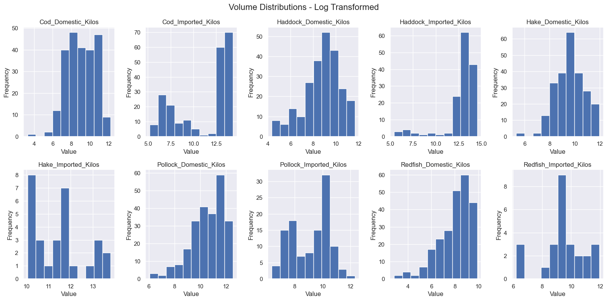
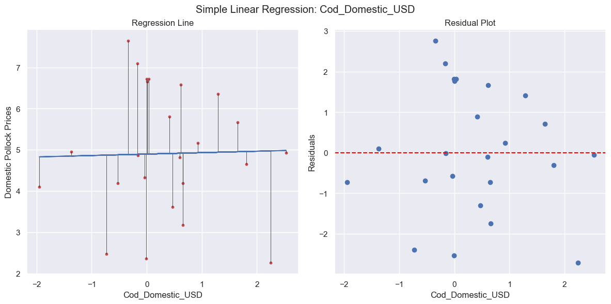
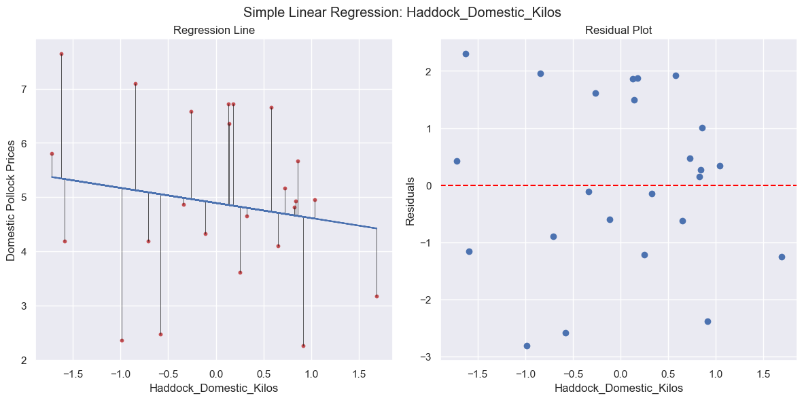
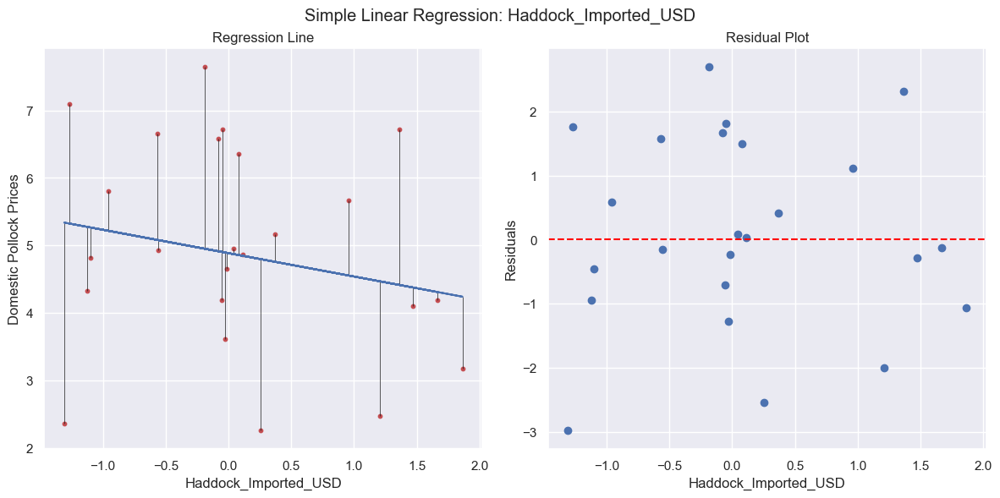
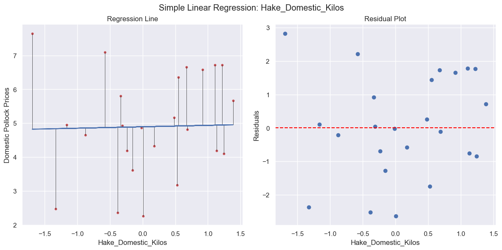
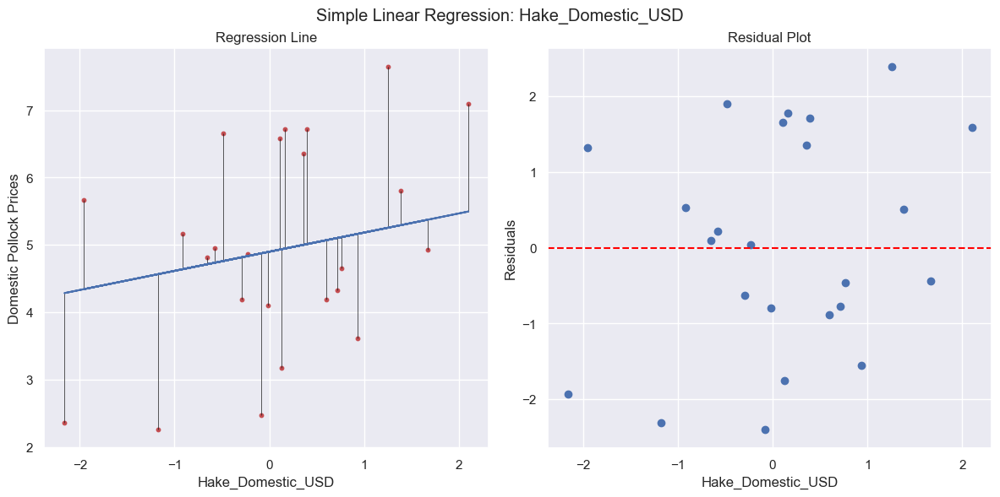
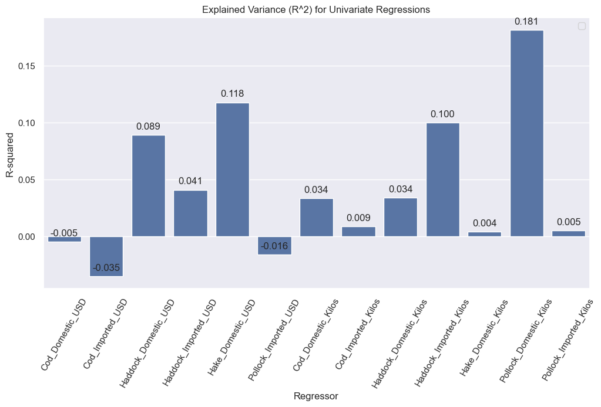

___
## Goal
 

___
## Approach


___
## Prep Data

### Format Data for Modeling


### Select Countries of Interest

```python
 data_filtered = data[data['Country'].isin(['USA', 'ICELAND', 'NORWAY', 'RUSSIAN FEDERATION'])]
 ```

### Create Pivot Tables


### Check Distribution of Features


### Transform Value Features



### Set Time Frame


### Drop NaN Values and Impute


### Visualize Data


### Correlations and Pairplots


### Shuffling


### Scaling


### Export Feature Matrix and Target Vector													


___
## Modeling

### Statsmodel ANOVA

```Markdown
                            OLS Regression Results                            
==============================================================================
Dep. Variable:                      y   R-squared:                       0.583
Model:                            OLS   Adj. R-squared:                  0.532
Method:                 Least Squares   F-statistic:                     11.40
Date:                Sat, 13 Apr 2024   Prob (F-statistic):           6.03e-15
Time:                        15:10:48   Log-Likelihood:                -150.79
No. Observations:                 120   AIC:                             329.6
Df Residuals:                     106   BIC:                             368.6
Df Model:                          13                                         
Covariance Type:            nonrobust                                         
==============================================================================
                 coef    std err          t      P>|t|      [0.025      0.975]
------------------------------------------------------------------------------
const          4.1701      0.083     50.503      0.000       4.006       4.334
x1             0.0035      0.104      0.034      0.973      -0.203       0.210
x2            -0.2576      0.128     -2.019      0.046      -0.511      -0.005
x3             0.3060      0.116      2.630      0.010       0.075       0.537
x4            -0.1352      0.090     -1.497      0.137      -0.314       0.044
x5             0.4108      0.102      4.010      0.000       0.208       0.614
x6             0.1533      0.107      1.430      0.156      -0.059       0.366
x7             0.1070      0.139      0.769      0.444      -0.169       0.383
x8             0.0656      0.096      0.684      0.495      -0.125       0.256
x9             0.1460      0.105      1.397      0.165      -0.061       0.353
x10           -0.3788      0.108     -3.502      0.001      -0.593      -0.164
x11            0.4179      0.122      3.429      0.001       0.176       0.660
x12           -0.9390      0.152     -6.159      0.000      -1.241      -0.637
x13            0.1043      0.092      1.133      0.260      -0.078       0.287
==============================================================================
Omnibus:                        1.794   Durbin-Watson:                   1.846
Prob(Omnibus):                  0.408   Jarque-Bera (JB):                1.331
Skew:                          -0.111   Prob(JB):                        0.514
Kurtosis:                       3.466   Cond. No.                         4.41
==============================================================================
```


### Univariate Regression











### Multivariate Regression


### PCR


### Ridge


### Lasso


___
## Selecting the Best Modeling Approach


___
## Signifigance Testing


___
## Results/Conclusion


___ 
## Acknowledgements


