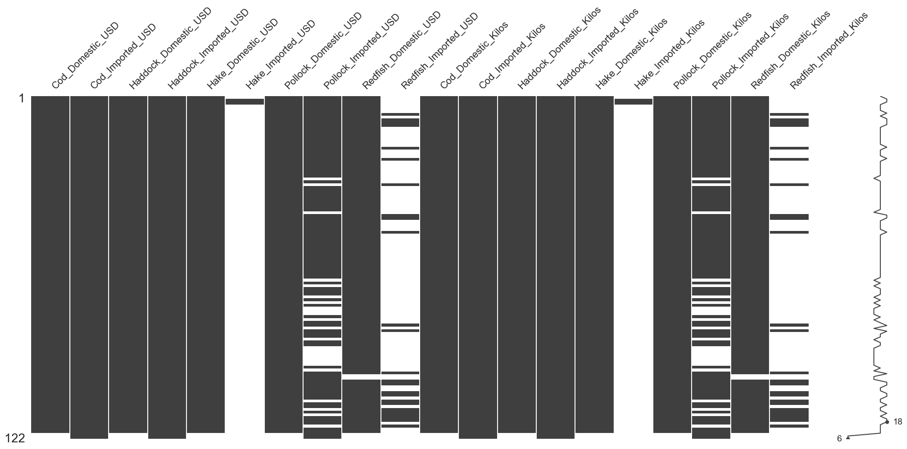
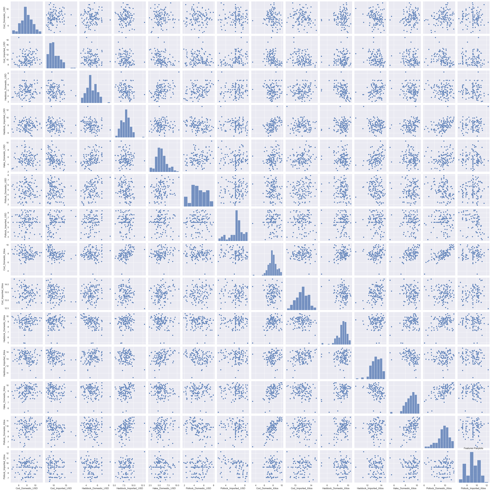
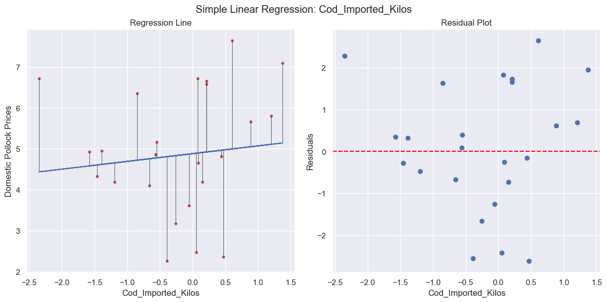
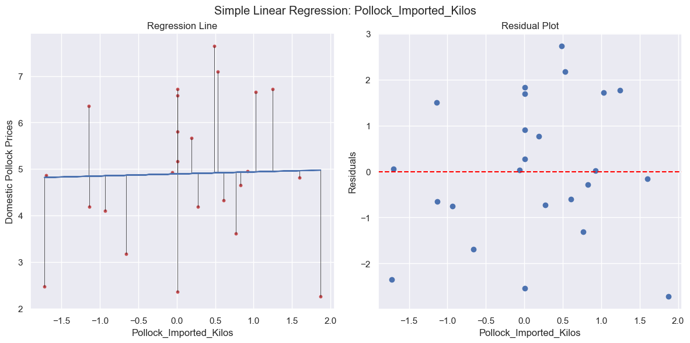
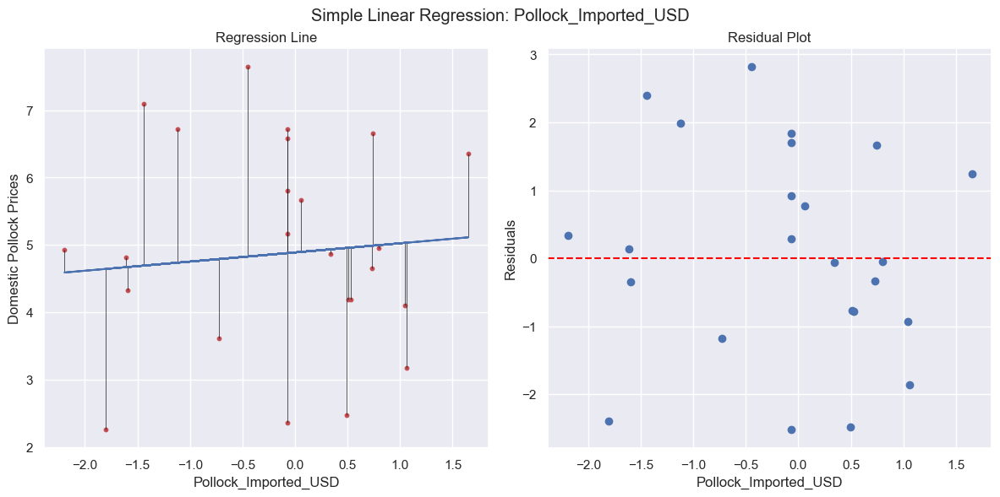
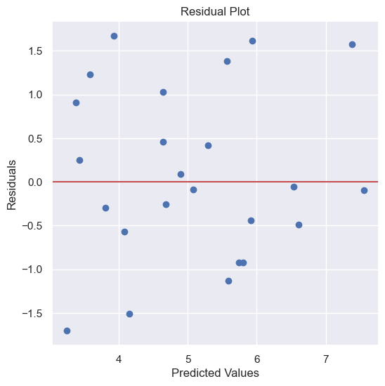
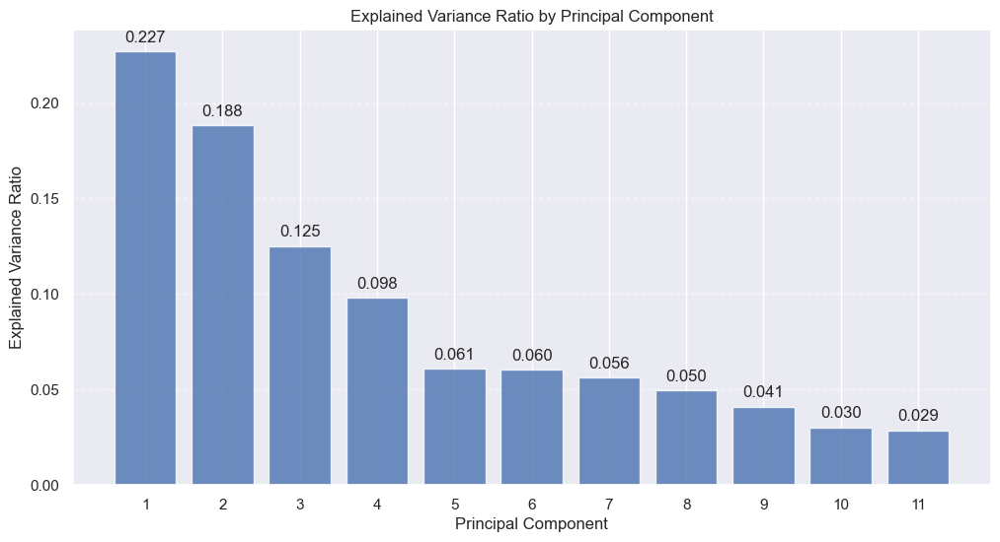
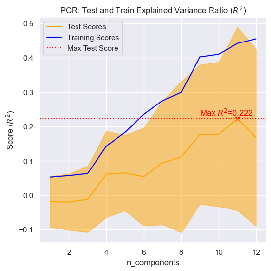
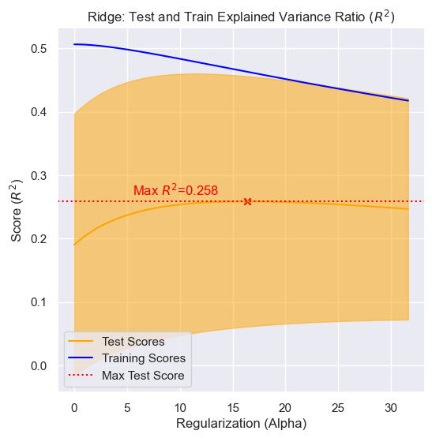

___
## Goal
 

___
## Approach


___
## Prep Data

### Format Data for Modeling


### Select Countries of Interest

```python
 data_filtered = data[data['Country'].isin(['USA', 'ICELAND', 'NORWAY', 'RUSSIAN FEDERATION'])]
 ```

### Create Pivot Tables


### Check Distribution of Features


### Transform Value Features


### Set Time Frame


### Drop NaN Values and Impute




### Visualize Data


### Correlations and Pairplots





### Shuffling


### Scaling


### Export Feature Matrix and Target Vector													


___
## Modeling

### Statsmodel ANOVA


### Univariate Regression









### Multivariate Regression





### PCR






### Ridge





### Lasso


___
## Selecting the Best Modeling Approach


___
## Signifigance Testing


___
## Results/Conclusion


___ 
## Acknowledgements


